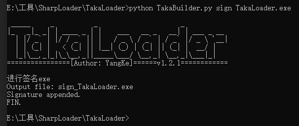
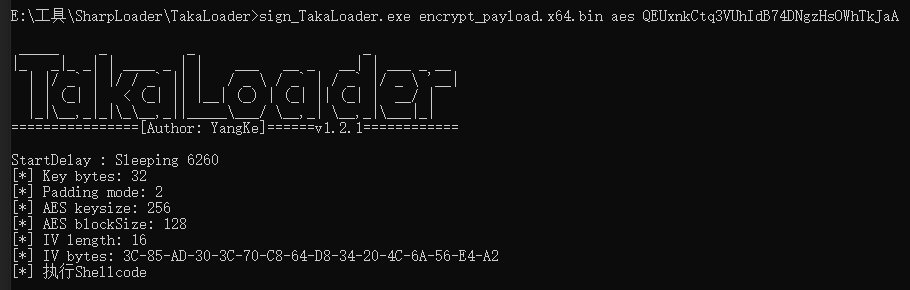
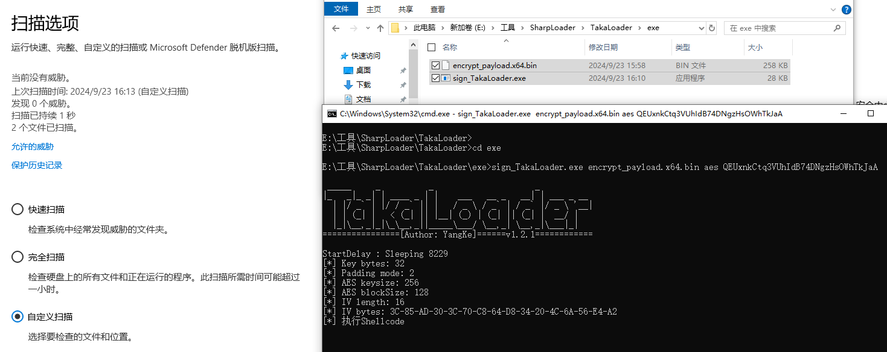
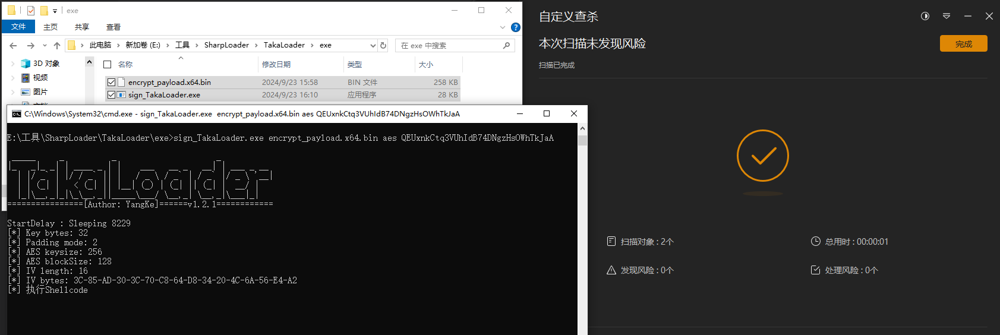

## 项目简介

攻防演练中经常需要进行钓鱼木马，但钓鱼木马很容易被散列而失效。 这个项目提供了一个工具，用于解密并加载shellcode。

这个项目支持RC4和AES两种解密方法,AntiAnalysis,并使用DInvoke来动态调用WinAPI函数。

## 功能

- **解密Shellcode**: 支持RC4和AES两种解密算法。
- **动态API调用**: 使用DInvoke动态调用WinAPI函数。
- **反沙箱技术**: 通过检查系统进程数量来尝试检测沙箱环境。
- **窃取程序数字签名:** 数字签名是无效的，但是可以起到模拟的作用
- **AntiAnalysis:** 检测VirtualBox,SandBox,Debugger
- **MutexCheck**

## 使用方法
使用TakaBuilder.py对payload文件进行aes或rc4加密，随后会在控制台输出密钥以及当前目录生成加密后的payload文件, 如下是aes加密的例子:
```
  python3 .\TakaBuilder.py encrypt .\payload.bin aes
```


使用TakaBuilder.py对exe文件进行签名,如例:
```
  python3 .\TakaBuilder.py sign TakaBuilder.exe
```


再使用本项目解密shellcode并加载, 使用方法如下:
```
  TakaLoader.exe [payload_path] [decryption_method] [key]
```

- `payload_path`: 加密的shellcode的路径。
- `decryption_method`: 使用的解密方法，可以是`rc4`或`aes`。
- `key`: 解密密钥。



## Windows Defender (2024.09.22 更新)



## 火绒 (2024.09.22 更新)



## 360 (2024.09.22 更新)


## 🚧 Disclaimer
项目仅供进行学习研究，切勿用于任何非法未授权的活动，如个人使用违反安全相关法律，后果与本人无关。

## 参考
https://github.com/secretsquirrel/SigThief

https://github.com/xf555er/SharpShellcodeLoader_Rc4Aes

https://github.com/Stealerium/Stealerium